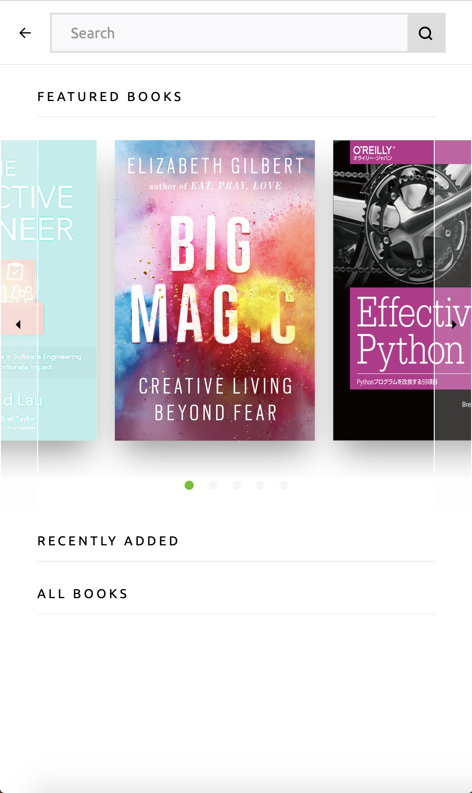
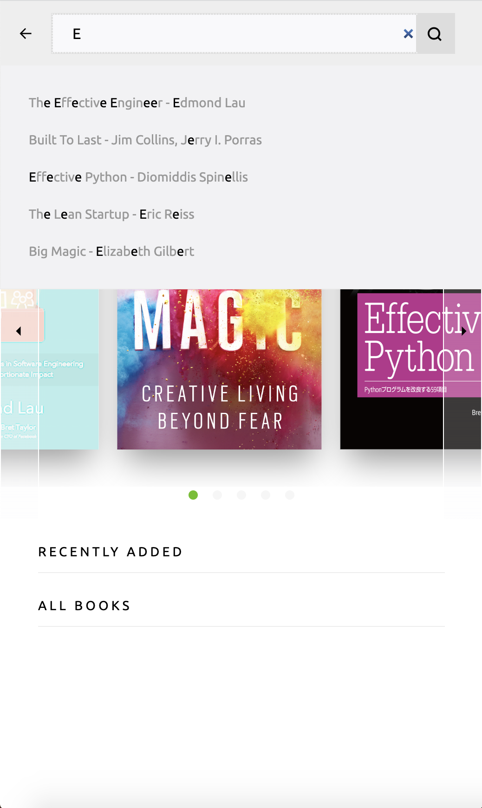
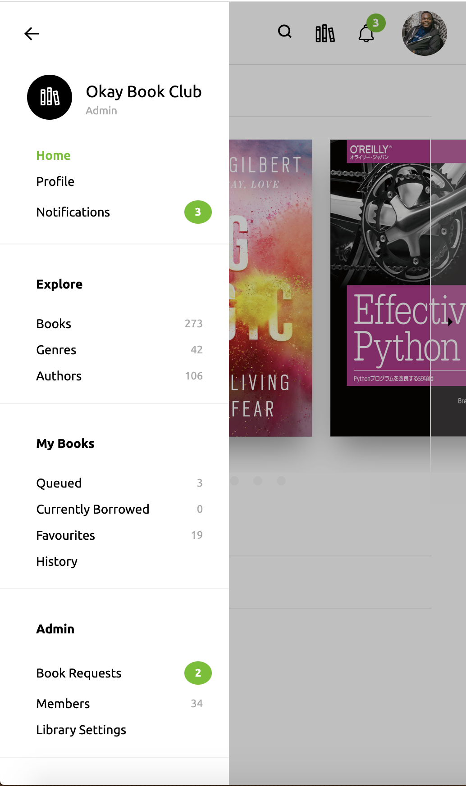
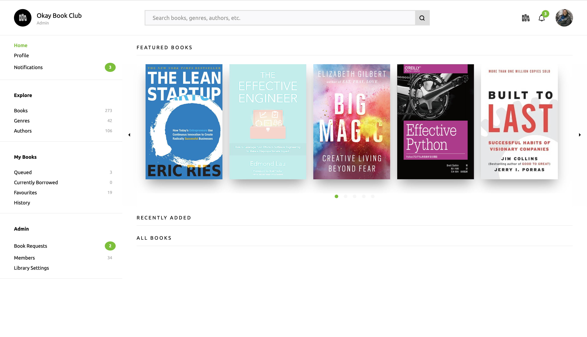

# OkayBooksUI
A dashboard UI for renting books online

# Getting Started
>This project requires **caddyserver** installed on your machine (SEE: [https://caddyserver.com/docs/install](https://caddyserver.com/docs/install)) to view it in a browser. Also, you have to register **okay.local** domain in your `etc/hosts` file as well.

- Open up the terminal (Linux/Mac) or command prompt (Windows)
- Change directory to this project folder after cloning from GIT: `cd OkayBookClub`
- Run `caddy run` command (Ensure to install **caddyserver** first)
- Open a browser and go load `https://okay.local/dashboard` in the address bar
