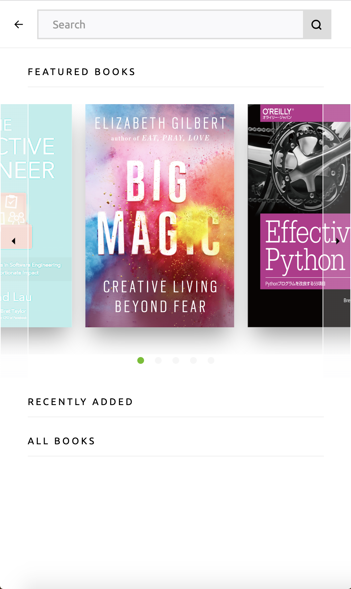
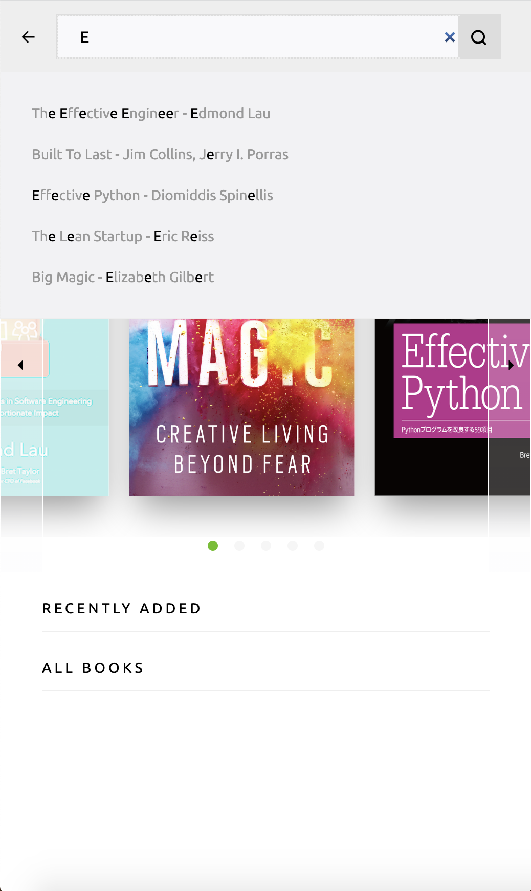
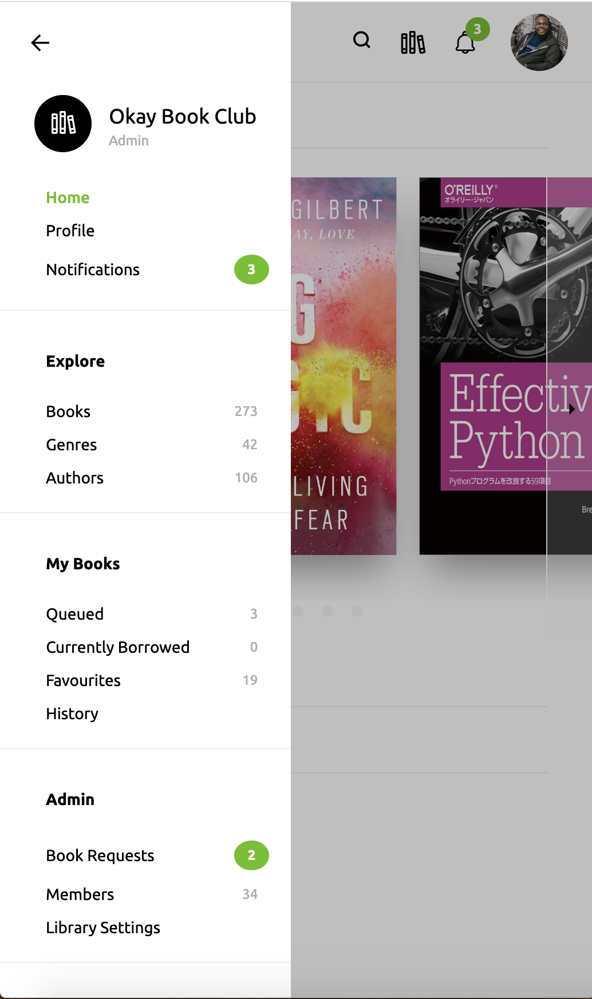
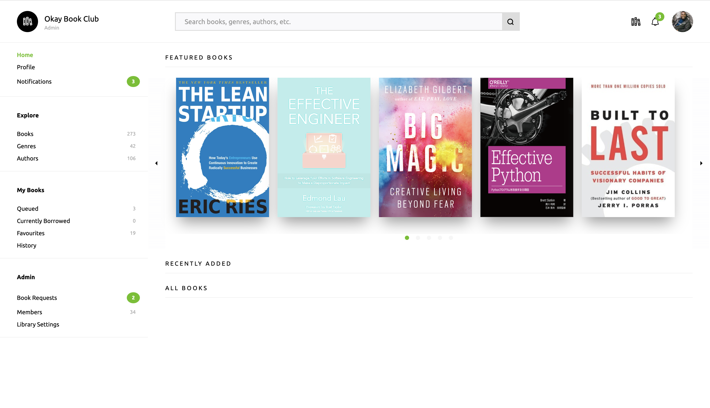

# OkayBooksUI
A dashboard UI for renting books online

# Getting Started
>This project requires **caddyserver** innstalled on your machine to view it in a browser. Also, you have to register **okay.local** domain in your `etc/hosts` file as well.

# Showcase

